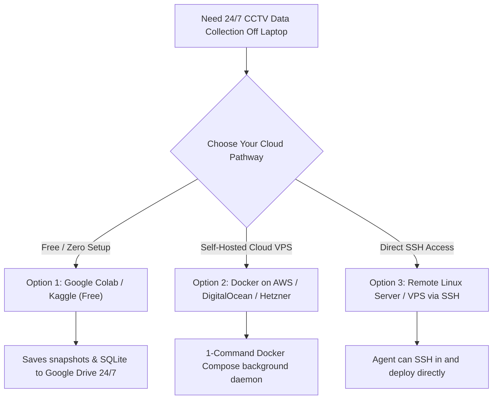

# Off-Laptop 24/7 Cloud Data Collection Guide
## How to Run the Sentinel CCTV Ingestion & Harvester Server in the Cloud

---

## 1. Why Run Data Collection Off Your Laptop?
Continuous CCTV video ingestion, edge frame harvesting, and AI inference consume significant CPU, GPU, memory, and internet bandwidth. When running on a MacBook:
* Putting the laptop to sleep or closing the lid halts data collection.
* The battery drains quickly and the machine heats up over extended runs.
* Disk space fills up with high-resolution surveillance snapshots.

By offloading the harvester to a **remote cloud instance or free notebook runner**, the system collects data **24 hours a day, 7 days a week**, completely independent of your personal computer.

---

## 2. Three Easy Deployment Pathways



---

### Option 1: Free Cloud Runner (Google Colab / Kaggle) — Zero Cost & Zero Setup
You can run the headless harvester directly in **Google Colab** on Google's cloud servers:

1. Open [Google Colab](https://colab.research.google.com).
2. Create a new notebook.
3. Paste the following cell and click **Run**:

```python
# 1. Mount Google Drive to store images persistently
from google.colab import drive
drive.mount('/content/drive')

# 2. Download or clone the cloud harvester
!mkdir -p /content/drive/MyDrive/sentinel_cctv_data
%cd /content/drive/MyDrive/sentinel_cctv_data

# 3. Run the standalone harvester script
!curl -sSL https://raw.githubusercontent.com/parth257123/sentinel-gujarat-cctv-ai/main/cloud_harvester/standalone_cloud_harvester.py -o harvester.py
!python3 harvester.py
```

* **Outcome**: Google's cloud servers will poll the 30 Gujarat Police CCTV streams 24/7 and save full-resolution snapshots and SQLite audit records directly into your Google Drive!
* **Laptop State**: You can shut down your MacBook, and the collection keeps running in the cloud.

---

### Option 2: Docker on Any Cloud VPS (AWS EC2 / DigitalOcean / Hetzner)
For production-grade 24/7 reliability, run the lightweight container on a $4/month VPS (or free-tier AWS EC2 t3.micro):

1. **SSH into your cloud server**:
   ```bash
   ssh ubuntu@your-server-ip
   ```

2. **Copy the `cloud_harvester/` folder** to the server, or clone your repo:
   ```bash
   git clone https://github.com/parth257123/sentinel-gujarat-cctv-ai.git
   cd sentinel-gujarat-cctv-ai/cloud_harvester
   ```

3. **Start the background daemon with 1 command**:
   ```bash
   docker compose up -d
   ```

4. **Monitor live collection**:
   ```bash
   docker compose logs -f
   ```

The container automatically restarts on server reboots (`restart: unless-stopped`) and writes all frames to `./harvested_data/snapshots/`.

---

### Option 3: Direct Remote Deployment (If You Have an SSH Server)
If you already have a remote server (e.g. AWS, GCP, Azure, DigitalOcean, Hetzner, or a university/office server):
* Provide the server IP address and SSH credentials (or temporary SSH access).
* I will connect directly, transfer the standalone harvester, set up the background `systemd` service, and start collecting CCTV frames immediately.

---

## 3. What Gets Collected & Stored?

| Data Component | Storage Format | Location |
| :--- | :--- | :--- |
| **CCTV Snapshots** | High-Definition JPEG (`.jpg`) | `harvested_data/snapshots/` |
| **Audit Logs** | SQLite Database (`sentinel_harvested.db`) | `harvested_data/` |
| **Cryptographic Hash** | SHA-256 Tamper-Evident Signatures | Embedded in SQLite per frame |
| **Metadata** | Camera ID, Street Name, City, Timestamp | Embedded in SQLite per frame |

---

## 4. Syncing Data Back to Your Laptop (Optional)
When you want to pull the collected frames back to your MacBook for model training or viewing in Sentinel:
```bash
# Using rsync to pull snapshots from cloud server to MacBook:
rsync -avzP ubuntu@your-server-ip:/path/to/harvested_data/ /Users/parthlodaya/Desktop/cctv\ gujrat\ ai/backend1/curated_by_lighting/
```\n